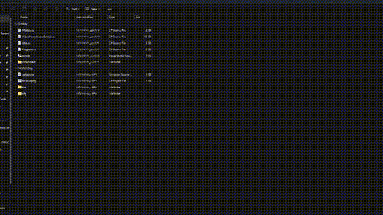

# fb-dl

<p align="center">
  
</p>

A command-line tool that saves public Facebook videos and reels as MP4 files.

Choose a quality, save videos to a folder, and resume interrupted downloads when the server supports it. Large videos can use four connections at once to improve download speed.

## Quick start

You need Git and the [.NET 10 SDK](https://dotnet.microsoft.com/download/dotnet/10.0) to build from source.

**1. Get the project and build it.**

```bash
git clone https://github.com/blackaly/fb-dl.git
cd fb-dl
dotnet build src/fb-dl.csproj -c Release
```

If you already have the project, open a terminal in its folder and run the build command.

**2. Download a video.**

Replace `VIDEO_ID` with the ID from your video's address, or replace the entire quoted URL with your Facebook video link.

```bash
dotnet src/bin/Release/net10.0/fb-dl.dll "https://www.facebook.com/reel/VIDEO_ID" --quality best --resume --output ./videos
```

This command chooses the best available quality, saves the video in `videos` inside your current folder, and keeps completed download parts if resume is supported.

The folder is created automatically. When the download finishes, the tool prints the saved file's location. Existing files are never overwritten.

## Common examples

Run these commands from the project folder after building it. Keep video links inside quotes, especially when they contain `&`.

### Choose a quality automatically

```bash
dotnet src/bin/Release/net10.0/fb-dl.dll "https://www.facebook.com/reel/VIDEO_ID" --quality hd
```

Use `best` for the highest available quality, `hd` for HD, or `sd` for SD. If you request HD or SD and it is unavailable, the tool reports an error.

### Choose a quality from the menu

```bash
dotnet src/bin/Release/net10.0/fb-dl.dll "https://www.facebook.com/reel/VIDEO_ID"
```

The tool lists the available qualities. Enter the number beside the one you want, or select Cancel.

### Resume an interrupted download

```bash
dotnet src/bin/Release/net10.0/fb-dl.dll "https://www.facebook.com/reel/VIDEO_ID" --quality best --resume --output ./videos
```

Use `--resume` on the first run. If the download stops, run the same command again with the same output folder and quality. The tool checks saved parts before reusing them. Resume depends on server support; some videos must restart from the beginning.

### Enter multiple video links interactively

```bash
dotnet src/bin/Release/net10.0/fb-dl.dll --output ./videos
```

Enter one URL at a time. After each download, you can enter another. Type `exit` to quit.

### Show help

```bash
dotnet src/bin/Release/net10.0/fb-dl.dll --help
```

## Options

| Option | What it does | Default |
| --- | --- | --- |
| `--output FOLDER` or `-o FOLDER` | Saves videos in the chosen folder. Quote paths containing spaces. | `Downloads` in your home folder |
| `--quality best`, `--quality hd`, `--quality sd` | Selects a quality without asking. | Shows the quality menu |
| `--resume` | Keeps completed parts so an interrupted download can continue later, when supported. | Off |
| `--connections N` | Sets the maximum number of download connections, from 1 to 8. | 4 |
| `--retries N` | Retries temporary failures 0 to 10 times after the first attempt. | 2 |
| `--help` or `-h` | Shows usage information. | — |

Options that take a value also accept `=`, for example `--quality=best` or `--connections=4`.

Press **Ctrl+C** to cancel. Press it again to force the program to exit if it is stuck.

## Download speed and reliability

Videos of at least **16 MiB** can download in parallel. The default is four connections; the actual number depends on the video size and server support. Use `--connections 1` to use a single connection.

More connections can help when a server limits the speed of each connection. They cannot increase your Internet connection's capacity. The tool falls back to a single connection when parallel downloading cannot be verified safely.

During a download, the terminal shows progress, speed, and estimated time remaining when available. Output redirected to a file stays brief.

Temporary network failures and HTTP 408, 429, and 5xx responses can be retried. The default is three attempts in total: the first attempt plus two retries. Failed parallel download parts can also be retried. An interrupted single-connection transfer may require running the command again.

The tool waits between retries and respects the server's requested delay. If that delay exceeds 30 seconds, it reports the delay and stops so you can try later. HTTP 400, 401, 403, and 404 are not retried automatically.

### How saved download parts work

With `--resume`, saved parts are kept in a hidden `.fb-dl` folder inside your output folder. Leave this folder in place if you want to continue an interrupted download. The tool verifies that the remote video has not changed and checks each saved part; damaged or incomplete parts are downloaded again.

Completed downloads are saved as normal MP4 files. Their temporary data is removed, although small lock files may remain. Without `--resume`, temporary files are removed after errors or normal cancellation. A forced exit may leave an incomplete `.part` file.

## Supported videos

- Public Facebook videos and reels with a directly downloadable MP4 version.
- Links on `facebook.com`, `fb.com`, `fb.watch`, and their subdomains.
- Available SD and HD versions. `best` prefers a supplied resolution, then HD over SD.

Videos that require login or private access are not supported. Streams provided only as DASH or HLS playlists are also not supported. Facebook page changes can affect extraction even when a video is public.

The tool checks the response type, MP4 header, and transfer length to avoid saving error pages or incomplete downloads as videos.

## Troubleshooting

| Problem | What to do |
| --- | --- |
| A .NET runtime is missing | Install .NET 10, or use a standalone executable as described below. Older commands pointing to `net9.0` should use `net10.0` after rebuilding. |
| HTTP 400, 403, or 404 | Check the video link and confirm the video is publicly accessible. Prefer the original Facebook page URL over a temporary media link. |
| No downloadable video found | The video may require login, be unavailable, or use a page or streaming format this tool does not support. |
| The tool uses one connection despite `--connections 4` | The video may be small, or the server may not support safe parallel downloads. The fallback is automatic. |
| A message mentions ranges or a strong ETag | The server cannot provide the checks needed to reuse video parts safely. The tool downloads from the beginning instead. |
| A resumed download starts over | Confirm you used `--resume` originally and kept the same output folder and quality. Changed video data or invalid saved parts may require downloading again. |
| The download is already active | Another process is using the same saved download. Let it finish or cancel it before trying again. |

## Standalone executables

A standalone executable includes .NET, so you can run it without installing the .NET runtime. Choose the build matching your computer.

| Computer | Build target | Executable |
| --- | --- | --- |
| Linux, Intel or AMD 64-bit, using glibc | `linux-x64` | `fb-dl` |
| Windows, Intel or AMD 64-bit | `win-x64` | `fb-dl.exe` |
| macOS, Intel | `osx-x64` | `fb-dl` |
| macOS, Apple Silicon | `osx-arm64` | `fb-dl` |

### Build one locally

Building still requires the .NET 10 SDK. For Linux:

```bash
dotnet publish src/fb-dl.csproj -c Release -r linux-x64 --self-contained true -p:PublishSingleFile=true -p:IncludeNativeLibrariesForSelfExtract=true -p:PublishTrimmed=false -p:DebugType=None -o artifacts/linux-x64
```

For another platform, replace `linux-x64` in both places with its build target from the table.

Run the Linux build from the project folder:

```bash
./artifacts/linux-x64/fb-dl "https://www.facebook.com/reel/VIDEO_ID" --quality best --resume --output ./videos
```

On Windows, the equivalent executable path is `./artifacts/win-x64/fb-dl.exe`. All options work the same way with a standalone executable.

### Build with GitHub Actions

The repository includes a manual [Standalone builds workflow](.github/workflows/build.yml). Once the workflow is on GitHub:

1. Open the repository's **Actions** tab.
2. Select **Standalone builds**, then **Run workflow**.
3. After the run succeeds, download the artifact for your platform.
4. Unzip the artifact, then extract the `.tar.gz` archive inside it.

Each build is tested on a matching operating system. The workflow creates downloadable build artifacts; it does not create a public release.

## Docker

Build the image from the project folder:

```bash
docker build -t fb-dl-app .
```

On Linux or macOS, create an output folder and mount it into the container:

```bash
mkdir -p videos
docker run --rm \
  --mount "type=bind,source=$(pwd)/videos,target=/downloads" \
  fb-dl-app "https://www.facebook.com/reel/VIDEO_ID" \
  --quality best --resume --output /downloads
```

The video and resume data stay in your local `videos` folder after the container exits. On Windows, replace the mount's source with an absolute path to your output folder. Add `-it` to `docker run` if you want to use the interactive menus.

## Development

Run the tests:

```bash
dotnet test tests/fb-dl.Tests.csproj -c Release
```

Run the download speed benchmark:

```bash
dotnet run --project benchmarks/fb-dl.Benchmark.csproj -c Release
```

Tests and benchmarks use local fixtures and do not contact Facebook. The benchmark compares one and four connections and verifies that both downloaded files match the source. See the [benchmark notes](benchmarks/README.md) for measured results and their limits.

For scripts, the program returns these exit codes:

| Code | Meaning |
| --- | --- |
| `0` | Success, help, normal exit, or cancellation through the quality menu |
| `1` | A download or other operation failed |
| `2` | Invalid command-line options |
| `130` | Cancelled with Ctrl+C |

Errors are written to standard error. Interactive mode allows another attempt after a failure, but still returns exit code `1` when you exit.

## Contributing

Report bugs or submit pull requests at [blackaly/fb-dl](https://github.com/blackaly/fb-dl). For a bug report, include the command you ran and the error message. Add regression tests when changing behavior.

## License

[MIT](LICENCE).
